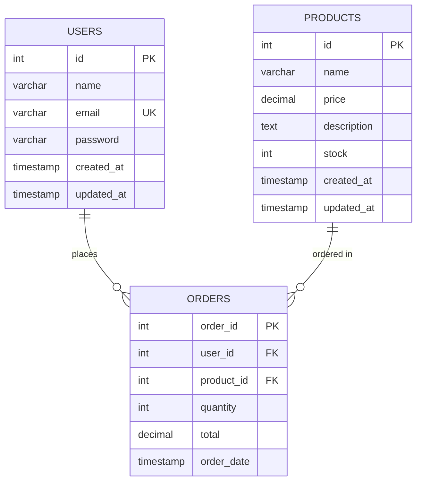

# Tugas Sesi 6 - Desain Database E-Commerce & Query CRUD (MySQL)

Dokumentasi ini berisi perancangan skema basis data MySQL untuk platform e-commerce beserta query lengkap **CRUD (Create, Read, Update, Delete)** pada tabel `products`.

---

## 1. Struktur Skema Database (`ecommerce_db`)

Database terdiri dari 3 tabel utama yang saling berelasi:



### Penjelasan Tabel:
1. **`users`**:
   - `id`: Primary Key, Auto Increment.
   - `name`: Nama lengkap pengguna (VARCHAR 100).
   - `email`: Email unik untuk akun pengguna (VARCHAR 100, UNIQUE).
   - `password`: Kata sandi pengguna (VARCHAR 255).
2. **`products`**:
   - `id`: Primary Key, Auto Increment.
   - `name`: Nama produk (VARCHAR 150).
   - `price`: Harga produk (DECIMAL 12,2).
   - `description`: Deskripsi detail spesifikasi produk (TEXT).
   - `stock`: Jumlah ketersediaan stok produk (INT).
3. **`orders`**:
   - `order_id`: Primary Key, Auto Increment.
   - `user_id`: Foreign Key merujuk ke `users(id)`.
   - `product_id`: Foreign Key merujuk ke `products(id)`.
   - `quantity`: Jumlah unit produk yang dibeli (INT).
   - `total`: Total nominal pembayaran pesanan (DECIMAL 14,2).
   - `order_date`: Waktu pencatatan transaksi (TIMESTAMP).

---

## 2. Query Pembuatan Database & Tabel (DDL)

```sql
-- 1. Buat Database
CREATE DATABASE IF NOT EXISTS ecommerce_db;
USE ecommerce_db;

-- 2. Buat Tabel Users
CREATE TABLE users (
    id INT AUTO_INCREMENT PRIMARY KEY,
    name VARCHAR(100) NOT NULL,
    email VARCHAR(100) NOT NULL UNIQUE,
    password VARCHAR(255) NOT NULL,
    created_at TIMESTAMP DEFAULT CURRENT_TIMESTAMP,
    updated_at TIMESTAMP DEFAULT CURRENT_TIMESTAMP ON UPDATE CURRENT_TIMESTAMP
) ENGINE=InnoDB;

-- 3. Buat Tabel Products
CREATE TABLE products (
    id INT AUTO_INCREMENT PRIMARY KEY,
    name VARCHAR(150) NOT NULL,
    price DECIMAL(12, 2) NOT NULL CHECK (price >= 0),
    description TEXT,
    stock INT NOT NULL DEFAULT 0 CHECK (stock >= 0),
    created_at TIMESTAMP DEFAULT CURRENT_TIMESTAMP,
    updated_at TIMESTAMP DEFAULT CURRENT_TIMESTAMP ON UPDATE CURRENT_TIMESTAMP
) ENGINE=InnoDB;

-- 4. Buat Tabel Orders (Relasi)
CREATE TABLE orders (
    order_id INT AUTO_INCREMENT PRIMARY KEY,
    user_id INT NOT NULL,
    product_id INT NOT NULL,
    quantity INT NOT NULL CHECK (quantity > 0),
    total DECIMAL(14, 2) NOT NULL CHECK (total >= 0),
    order_date TIMESTAMP DEFAULT CURRENT_TIMESTAMP,
    FOREIGN KEY (user_id) REFERENCES users(id) ON DELETE CASCADE ON UPDATE CASCADE,
    FOREIGN KEY (product_id) REFERENCES products(id) ON DELETE CASCADE ON UPDATE CASCADE
) ENGINE=InnoDB;
```

---

## 3. Query CRUD (Create, Read, Update, Delete) Data Produk

### A. CREATE (Menambah Data Produk)
```sql
-- Menambah 1 produk baru
INSERT INTO products (name, price, description, stock) 
VALUES (
    'USB-C Multiport Hub 7-in-1', 
    320000.00, 
    'Adapter USB Type-C dengan port 4K HDMI, 3x USB 3.0, SD/TF Card Reader, dan 100W PD.', 
    50
);

-- Menambah banyak produk sekaligus (Batch Insert)
INSERT INTO products (name, price, description, stock) VALUES
('Monitor Gaming Curved 27 Inch 165Hz', 2850000.00, 'Monitor IPS 2K QHD 1ms FreeSync & G-Sync.', 12),
('Aluminium Laptop Stand Ergonomis', 175000.00, 'Dudukan laptop lipat bahan aluminium kokoh.', 65);
```

### B. READ (Membaca / Menampilkan Data Produk)
```sql
-- 1. Menampilkan seluruh produk
SELECT * FROM products;

-- 2. Menampilkan kolom tertentu
SELECT id, name, price, stock FROM products;

-- 3. Menampilkan produk berdasarkan ID spesifik
SELECT * FROM products WHERE id = 1;

-- 4. Filter produk dengan harga < 1.000.000 diurutkan termurah
SELECT * FROM products 
WHERE price < 1000000.00 
ORDER BY price ASC;

-- 5. Pencarian produk berdasarkan kata kunci nama (LIKE)
SELECT * FROM products 
WHERE name LIKE '%Wireless%';
```

### C. UPDATE (Mengubah Data Produk)
```sql
-- 1. Mengubah harga dan stok produk berdasarkan ID
UPDATE products 
SET 
    price = 799000.00, 
    stock = 35 
WHERE id = 1;

-- 2. Mengubah deskripsi produk
UPDATE products 
SET 
    description = 'Keyboard mekanikal RGB versi upgrade 2026 dengan peredam suara silicone pad.' 
WHERE id = 1;

-- 3. Mengurangi stok produk saat terjadi pembelian
UPDATE products 
SET stock = stock - 2 
WHERE id = 4 AND stock >= 2;
```

### D. DELETE (Menghapus Data Produk)
```sql
-- 1. Menghapus produk berdasarkan ID tertentu
DELETE FROM products 
WHERE id = 6;

-- 2. Menghapus produk yang stoknya habis (0)
DELETE FROM products 
WHERE stock = 0;
```

---

## 4. Query Tambahan: Relasi (JOIN Table)

Untuk menampilkan detail pesanan lengkap dengan nama pembeli dan nama produk:

```sql
SELECT 
    o.order_id,
    u.name AS nama_customer,
    u.email AS email_customer,
    p.name AS nama_produk,
    p.price AS harga_satuan,
    o.quantity AS jumlah_beli,
    o.total AS total_pembayaran,
    o.order_date AS tanggal_transaksi
FROM orders o
JOIN users u ON o.user_id = u.id
JOIN products p ON o.product_id = p.id
ORDER BY o.order_id ASC;
```
